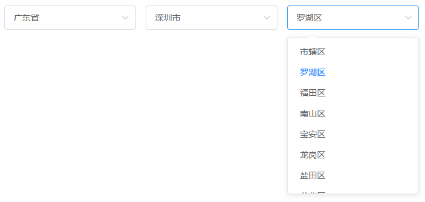

# Vue_CitySelector
中国城市三级联动下拉选择器
包含港澳台



基于 [vue2](https://github.com/vuejs/vue)

之前是放在[githubt:practice/Select4CityofChina](https://github.com/think2cat/practice/tree/master/Select4CityofChina)里面

因为实际使用比较多，干脆独立出来，方便分支

## 安装
```
npm i think2cat/Vue_CitySelector --save
```

## 使用

示例请看 [src/App.vue](blob/master/src/App.vue)

```
1. import module
import CitySelector from 'cityselector'

2. add component for Vue
components: { CitySelector },

3. add html
<CitySelector @change="handelChange"/>
```

给组件绑定change事件，当下拉框值有改动时触发返回json

```json
{
  "provinceId": "440000",
  "cityId": "440300",
  "areaId": "440303",
  "provinceName": "广东省",
  "cityName": "深圳市",
  "areaName": "罗湖区",
  "str": "广东省深圳市罗湖区"
}
```

组件同时预留了初始化值 val ，方便修改区域时使用
```
<CitySelector val="440303"/>
```
初始地址为广东深圳罗湖，目前只能填写三级areaId值才有效，如果传入的为广东省provinceId则无效